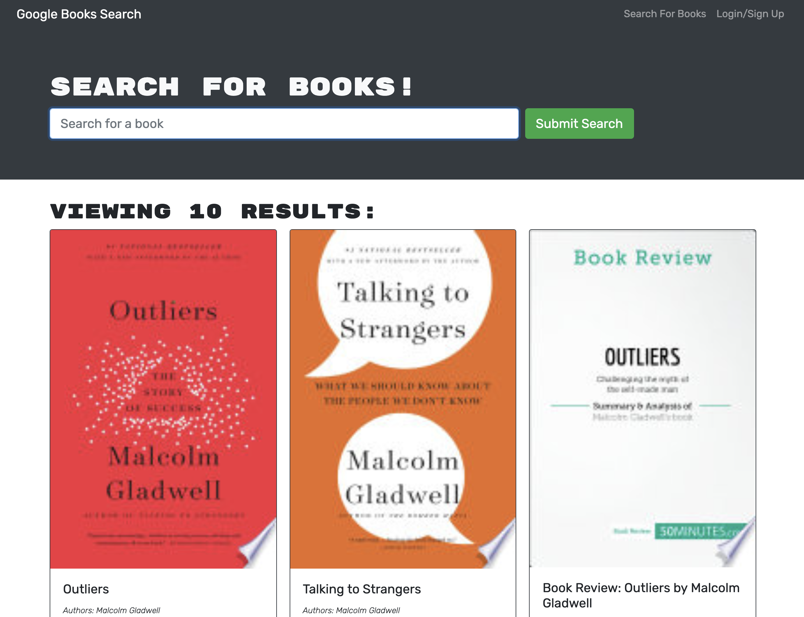

# Book Search Engine

[![Contributors][contributors-shield]][contributors-url]
[![Forks][forks-shield]][forks-url]
[![Stargazers][stars-shield]][stars-url]
[![Issues][issues-shield]][issues-url]
[![MIT License][license-shield]][license-url]

<!-- PROJECT LOGO -->
<br />
<p align="center">
  <a href="https://github.com/jsun994/book-search-mern">
    
  </a>

  <p align="center">
  A google book search.
    <br />
    <a href="https://github.com/jsun994/book-search-mern"><strong>Explore the docs »</strong></a>
    <br />
    <br />
    <a href="https://book-mern-search.herokuapp.com/">View Demo</a>
    ·
    <a href="https://github.com/jsun994/book-search-mern">Report Bug</a>
    ·
    <a href="https://github.com/jsun994/book-search-mern">Request Feature</a>
  </p>
</p>

<!-- TABLE OF CONTENTS -->
<details open="open">
  <summary><h2 style="display: inline-block">Table of Contents</h2></summary>
  <ol>
    <li>
      <a href="#about-the-project">About The Project</a>
      <ul>
        <li><a href="#built-with">Built With</a></li>
      </ul>
    </li>
    <li>
      <a href="#getting-started">Getting Started</a>
      <ul>
        <li><a href="#prerequisites">Prerequisites</a></li>
        <li><a href="#installation">Installation</a></li>
      </ul>
    </li>
    <li><a href="#usage">Usage</a></li>
    <li><a href="#contributing">Contributing</a></li>
    <li><a href="#contact">Contact</a></li>
  </ol>
</details>

<!-- ABOUT THE PROJECT -->
## About The Project


Deployed - [Heroku](https://book-mern-search.herokuapp.com/)

### Built With

* MERN
* graphql

<!-- GETTING STARTED -->
## Getting Started

To get a local copy up and running follow these simple steps.

### Prerequisites

This is an example of how to list things you need to use the software and how to install them.
* npm
  ```sh
  npm install npm@latest -g
  ```

### Installation

1. Clone the repo
   ```sh
   git clone git@github.com:jsun994/book-search-mern.git
   ```
2. Install NPM packages
   ```sh
   npm install
   ```

<!-- USAGE EXAMPLES -->
## Usage

    GIVEN a book search engine
    WHEN I load the search engine
    THEN I am presented with a menu with the options Search for Books and Login/Signup and an input field to search for books and a submit button
    WHEN I click on the Search for Books menu option
    THEN I am presented with an input field to search for books and a submit button
    WHEN I am not logged in and enter a search term in the input field and click the submit button
    THEN I am presented with several search results, each featuring a book’s title, author, description, image, and a link to that book on the Google Books site
    WHEN I click on the Login/Signup menu option
    THEN a modal appears on the screen with a toggle between the option to log in or sign up
    WHEN the toggle is set to Signup
    THEN I am presented with three inputs for a username, an email address, and a password, and a signup button
    WHEN the toggle is set to Login
    THEN I am presented with two inputs for an email address and a password and login button
    WHEN I enter a valid email address and create a password and click on the signup button
    THEN my user account is created and I am logged in to the site
    WHEN I enter my account’s email address and password and click on the login button
    THEN I the modal closes and I am logged in to the site
    WHEN I am logged in to the site
    THEN the menu options change to Search for Books, an option to see my saved books, and Logout
    WHEN I am logged in and enter a search term in the input field and click the submit button
    THEN I am presented with several search results, each featuring a book’s title, author, description, image, and a link to that book on the Google Books site and a button to save a book to my account
    WHEN I click on the Save button on a book
    THEN that book’s information is saved to my account
    WHEN I click on the option to see my saved books
    THEN I am presented with all of the books I have saved to my account, each featuring the book’s title, author, description, image, and a link to that book on the Google Books site and a button to remove a book from my account
    WHEN I click on the Remove button on a book
    THEN that book is deleted from my saved books list
    WHEN I click on the Logout button
    THEN I am logged out of the site and presented with a menu with the options Search for Books and Login/Signup and an input field to search for books and a submit button  

<!-- CONTRIBUTING -->
## Contributing

1. Fork the Project
2. Create your Feature Branch (`git checkout -b feature/AmazingFeature`)
3. Commit your Changes (`git commit -m 'Add some AmazingFeature'`)
4. Push to the Branch (`git push origin feature/AmazingFeature`)
5. Open a Pull Request

<!-- CONTACT -->
## Contact

Jay Sun - [email me](mailto:jaysun054@gmail.com)

[contributors-shield]: https://img.shields.io/github/contributors/jsun994/book-search-mern.svg?style=for-the-badge
[contributors-url]: https://github.com/jsun994/book-search-mern/graphs/contributors
[forks-shield]: https://img.shields.io/github/forks/jsun994/book-search-mern.svg?style=for-the-badge
[forks-url]: https://github.com/jsun994/book-search-mern/network/members
[stars-shield]: https://img.shields.io/github/stars/jsun994/book-search-mern.svg?style=for-the-badge
[stars-url]: https://github.com/jsun994/book-search-mern/stargazers
[issues-shield]: https://img.shields.io/github/issues/jsun994/book-search-mern.svg?style=for-the-badge
[issues-url]: https://github.com/jsun994/book-search-mern/issues
[license-shield]: https://img.shields.io/github/license/jsun994/book-search-mern.svg?style=for-the-badge
[license-url]: https://github.com/jsun994/book-search-mern/blob/master/LICENSE.txt